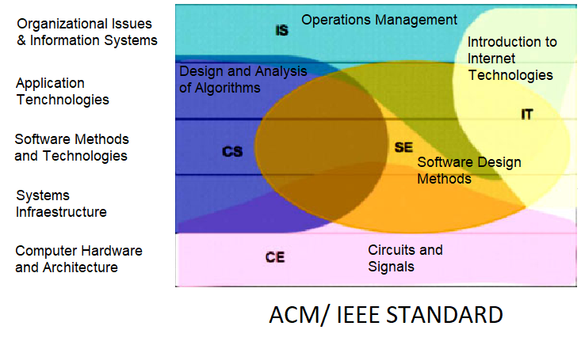

# Improving Embeddings Representations for Comparing Higher Education Curricula: A Use Case in Computing

This is the official repository of the EMNLP2022 main conference named "Improving Embeddings Representations for Comparing Higher Education Curricula: A Use Case in Computing".

Visit our paper:

[ACL link](https://aclanthology.org/2022.emnlp-main.776/) 

## Overview

We automatize the classification (that also allows human interpretess) of computing curriculas under the ACM/ IEEE standard.



## Dataset

Dataset is in the DATA_TG100 file in this github repo.

## Installation

1. Create a conda enviorenment

```
conda create --name py37-curriculas python=3.7
conda activate py37-curriculas
```

2. Install the requirements

```
pip install -r requirements.txt
```

3. Download glove and word2vec models and create a directory Model to store them.
   
```
Link:https://drive.google.com/drive/folders/1B04C5JDj_wSHsvaioa09hBgGaROKi_8u?usp=sharing
```

## Usage

1. Activate the conda enviorenment

```
conda activate py37-curriculas
```

2. Generate the embeddings representation (If curricula mode is used, you can directly test or plot the model. If curso mode is used, you need to perform step 3)

```
python3 generate_representations.py --model [bert|cl_bert|lm_bert|ml_bert|word2vec|glove] --mode [curricula|curso] DATA_TG100/
```

3. Perform metric learning and attention over subjects to obtain a representation of a curriculum.

```
python3 metric_learning.py --model [bert_curso|cl_bert_curso|lm_bert_curso|ml_bert_curso|word2vec_curso|glove_curso] --mode AL
```


4. Plot representations

```
python3 plot_representations.py <model_name> (embeddings with mode curso -- generated in step 2 -- are not valid)
```

5. Metric Evaluation (Test)

```
python3 metrics_valid.py --nargs <model_name> (embeddings with mode curso -- generated in step 2 -- are not valid)
```


## Cite our work

```
@inproceedings{murrugarra-llerena-etal-2022-improving,
    title = "Improving Embeddings Representations for Comparing Higher Education Curricula: A Use Case in Computing",
    author = "Murrugarra-Llerena, Jeffri  and
      Alva-Manchego, Fernando  and
      Murrugarra-LLerena, Nils",
    booktitle = "Proceedings of the 2022 Conference on Empirical Methods in Natural Language Processing",
    month = dec,
    year = "2022",
    address = "Abu Dhabi, United Arab Emirates",
    publisher = "Association for Computational Linguistics",
    url = "https://aclanthology.org/2022.emnlp-main.776",
    pages = "11299--11307",
    abstract = "We propose an approach for comparing curricula of study programs in higher education. Pre-trained word embeddings are fine-tuned in a study program classification task, where each curriculum is represented by the names and content of its courses. By combining metric learning with a novel course-guided attention mechanism, our method obtains more accurate curriculum representations than strong baselines. Experiments on a new dataset with curricula of computing programs demonstrate the intuitive power of our approach via attention weights, topic modeling, and embeddings visualizations. We also present a use case comparing computing curricula from USA and Latin America to showcase the capabilities of our improved embeddings representations.",
}

```
